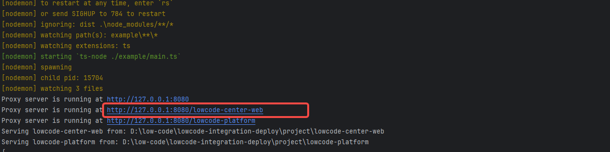

import Run from "./component/Run";

# 本地部署

如果只是想本地体验，可根据以下步骤在本地体验。

## 数据库

按前数据库篇步骤，准备好数据库配置

## 项目准备

1. 下载克隆代码，执行 ```install```

<Run command={'install'} />


## 环境变量

编辑工程根目录下的 .env

```
NODE_ENV = production
MYSQL = *.*.*.*
MYSQL_PORT = 3306
MYSQL_USER = root
MYSQL_PASSWORD = *********
MYSQL_DATABASE_NAME = b_lowcode_center_database
REDIS = redis://:*********************************************
SERVER_PORT = 10009
```

## 服务启动

1. 执行 ```dev```

<Run command={'dev'} />

当控制台出现以下提示，表示服务已经启动成功



2. 管理端默认运行在 http://127.0.0.1:8080/lowcode-center-web


