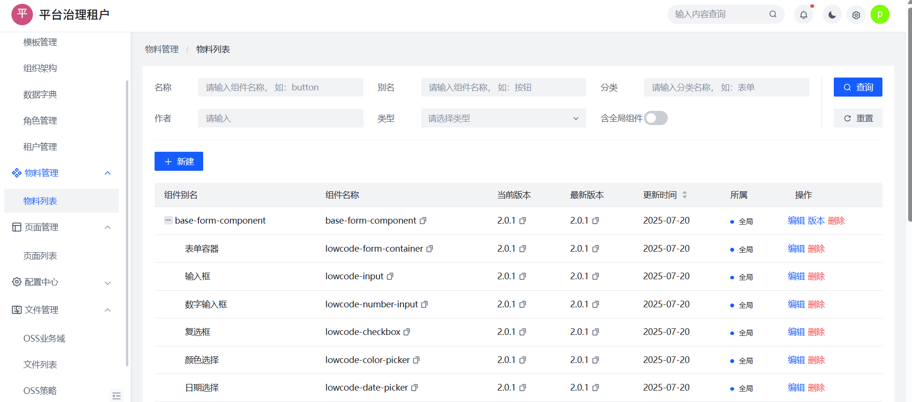
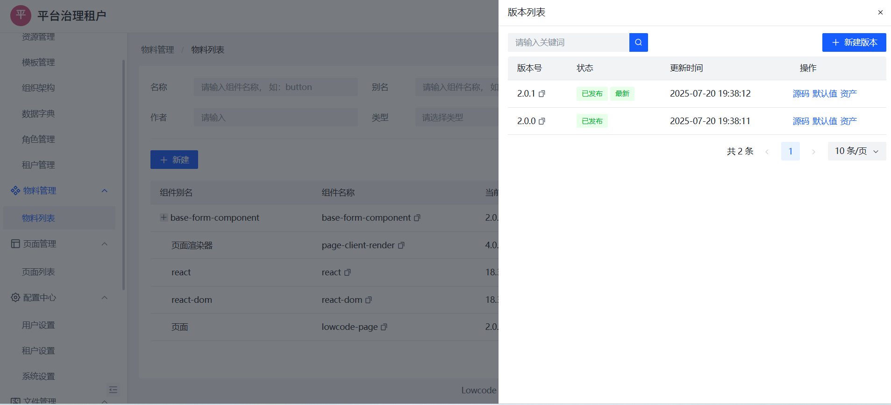
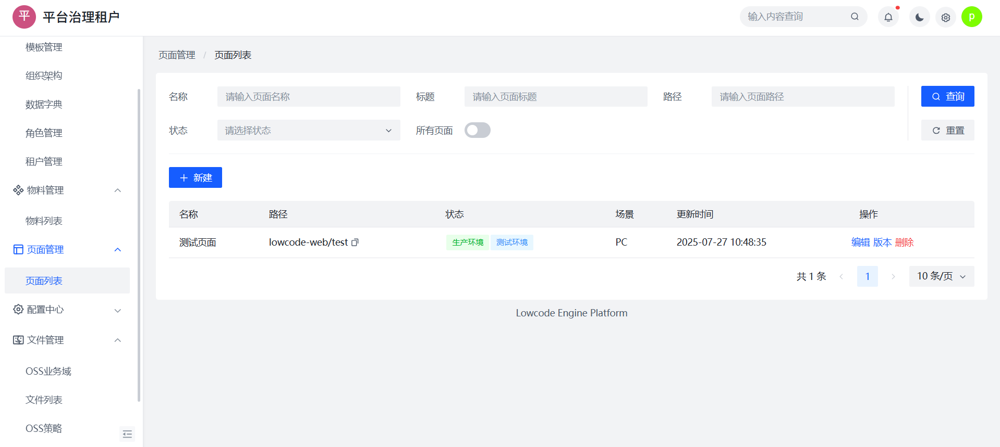
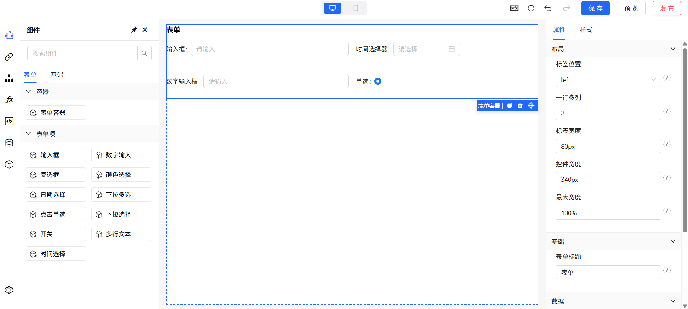
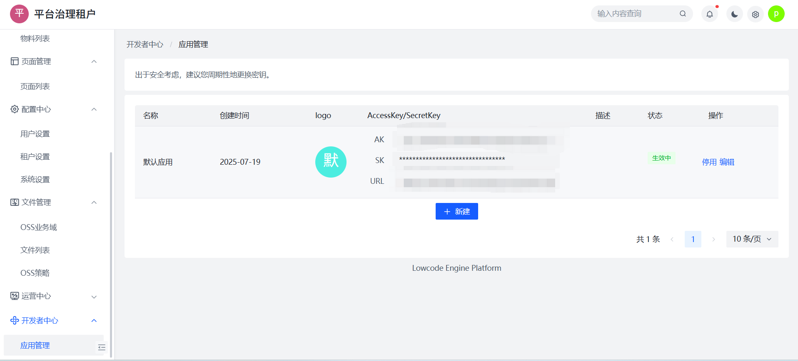

# 平台使用指南

本章节将介绍如何访问低代码引擎平台、了解主要模块功能，并快速发布第一个页面。

## 访问入口

平台部署地址如下：

> 🔗 [点击访问 DEMO](https://lowcode.canyuegongzi.xyz/lowcode-center-web/platform/widget/list)

> 👤 **体验账号**：  
> 账号：`demo_normal_user`  
> 密码：`demo_normal_user123`
> 租户：`演示租户`

## 功能概览

低代码平台包含了以下核心模块：

### 🎨 组件物料管理

物料管理是平台构建能力的基础，用于统一维护组件（物料）的元信息、版本信息与依赖内容。

- 支持组件分类管理、版本控制；
- 可查看组件的当前版本、所属分类、更新时间；
- 支持跳转查看组件依赖资源与源码配置。

📷 页面示意：

其中，组件支持折叠展示，点击组件名可查看版本信息：

### 📄 页面管理

页面管理用于维护各类页面资源，支持页面的创建、状态切换、发布流程。

- 支持页面名称、路径、状态筛选；
- 可设置页面为“生产环境”或“测试环境”；
- 支持页面版本维护与跳转预览。

📷 页面示意：

### 🧩 页面设计器（搭建画布）

设计器是平台的核心能力，支持：

- 拖拽组件构建页面结构；
- 实时属性配置与样式调整；
- 数据绑定与交互逻辑定义；
- 页面实时预览、保存与发布；

📷 搭建示意：

左侧为组件区，支持表单、容器、基础组件等物料拖拽。右侧为属性配置面板，支持样式、布局、数据绑定等能力。

### 🔐 开发者中心

开发者中心提供 API 网关接入与安全密钥配置能力，用于将平台与后端服务或第三方服务打通。

- 支持生成 AccessKey / SecretKey；
- 支持对接鉴权服务、安全配置等；
- 每个应用可设置 Logo、URL、启用状态；

📷 页面示意：

## 🚀 快速发布你的第一个页面

只需 3 步，即可完成页面从创建 → 搭建 → 发布的流程：

### 1️⃣ 新建页面

进入【页面管理】，点击「新建」，填写页面名称与路径。

### 2️⃣ 拖拽搭建页面

进入设计器，左侧选择组件拖入画布，中间实时预览，右侧配置属性、样式与交互逻辑。

📷 示意图参考搭建画布截图

### 3️⃣ 发布页面

点击页面右上角「发布」按钮，选择环境（测试/生产），即可生成线上可访问地址。

📍 可参考：[页面搭建](/guide/page/page)

## ✅ 小结

通过平台的可视化设计能力与统一的组件物料体系，用户无需手写代码即可快速构建业务页面，并可灵活发布至不同环境，真正实现「搭建即上线」。