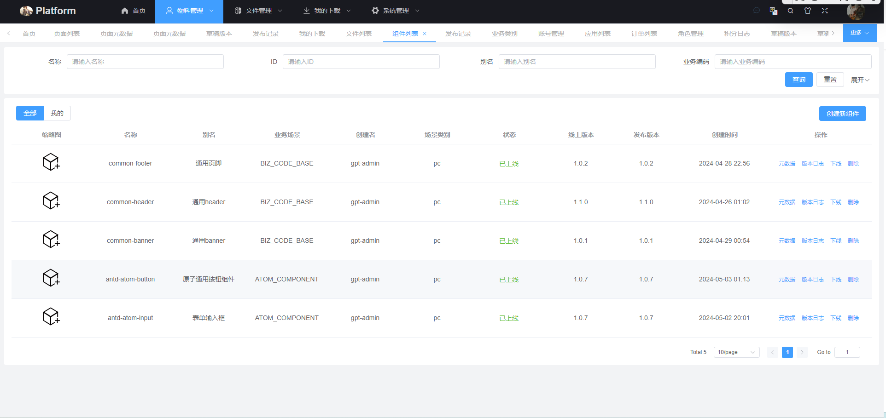

# 平台使用

## 访问地址

低代码引擎的 Demo 可以通过如下永久链接访问到：

[DEMO](https://static-cdn.ry-ltd.site/lowcode-center-web/#/atomManagement/pageManage/list)

## 演示账号

demo / demo

## 功能概览

### 数据管理

包括基础的物料、页面、构建产物的维护。

#### 物料维护

#### 页面维护

### 搭建画布

搭建平台的核心部分，包括沙箱渲染、动态表单配置、页面发布等。

设计器承载着低代码平台的核心功能，包括物料开发导入、编排、组件配置、画布渲染、页面打包发布等等。

## 发布第一个页面

请移步 [页面搭建](/guide/operation/build-page) 