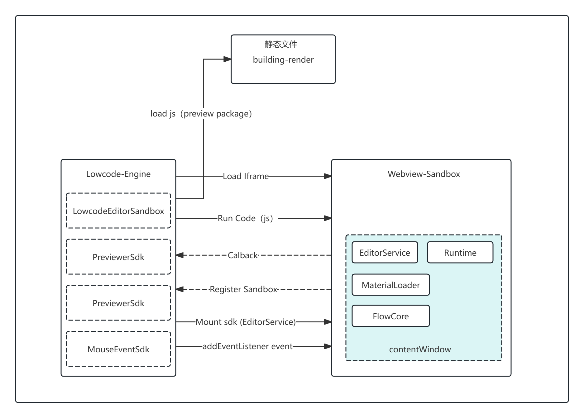

import { Badge } from '@theme';

# 沙箱

## 概述

因编辑器输入代码的不可信任，所以需要一个沙箱环境来执行代码, 防止程序访问 / 影响主页面, 主要用于隔离搭建侧和画布预览侧的作用域。

:::tip

在计算机安全中，沙箱（Sandbox）是一种用于隔离正在运行程序的安全机制，通常用于执行未经测试或不受信任的程序或代码，它会为待执行的程序创建一个独立的执行环境，内部程序的执行不会影响到外部程序的运行

:::

画布使用了最传统的 Iframe 方案，它的兼容性最好，功能最完善（沙箱做的最彻底，js 作用域、css 隔离等），但此处还是列举了几个社区中其他的沙箱方案。

## 其他方案
### Proxy Sandbox

可以通过代理 Proxy 实现对象的劫持，通过 window 对象的修改进行记录，在卸载时删除这些记录，在应用再次激活时恢复这些记录，来达到模拟沙箱环境的目的。

```ts
// 修改 window 属性的公共方法
const updateHostProp = (prop: any, value, isDel?) => {
  if (value === undefined || isDel) {
    delete window[prop];
  } else {
    window[prop] = value;
  }
};

class ProxySandbox {private currentUpdatedPropsValueMap = new Map()
    private modifiedPropsMap = new Map()
    private addedPropsMap = new Map()
    public name: string = "";
    public proxy: any;

    /**
     * 激活沙箱
     */
    public active() {
        // 根据记录还原沙箱
        this.currentUpdatedPropsValueMap.forEach((v, p) => updateHostProp(p, v));
    }

    /**
     * 关闭沙箱
     */
    public inactive() {
        // 1 将沙箱期间修改的属性还原为原先的属性
        this.modifiedPropsMap.forEach((v, p) => updateHostProp(p, v));
        // 2 将沙箱期间新增的全局变量消除
        this.addedPropsMap.forEach((_, p) => updateHostProp(p, undefined, true));
    }

    constructor(name) {
        this.name = name;
        this.proxy = null;
        // 存放新增的全局变量
        this.addedPropsMap  = new Map();
        // 存放沙箱期间更新的全局变量
        this.modifiedPropsMap = new Map();
        // 存在新增和修改的全局变量，在沙箱激活的时候使用
        this.currentUpdatedPropsValueMap = new Map();

        const {addedPropsMap, currentUpdatedPropsValueMap, modifiedPropsMap} = this;
        const fakeWindow = Object.create(null);
        const proxy = new Proxy(fakeWindow, {set(target, prop, value) {if (!window.hasOwnProperty(prop)) {
                    // 如果 window 上没有的属性，记录到新增属性里
                    addedPropsMap.set(prop, value);
                } else if (!modifiedPropsMap.has(prop)) {
                    // 如果当前 window 对象有该属性，且未更新过，则记录该属性在 window 上的初始值
                    const originalValue = window[prop];
                    modifiedPropsMap.set(prop, originalValue);
                }
                // 记录修改属性以及修改后的值
                currentUpdatedPropsValueMap.set(prop, value);
                // 设置值到全局 window 上
                updateHostProp(prop, value);
                return true;
            },
            get(target, prop) {return window[prop];
            },
        });
        this.proxy = proxy;
    }
}

const newSandBox: ProxySandbox = new ProxySandbox(' 代理沙箱 ');
const proxyWindow = newSandBox.proxy;
proxyWindow.a = '1';
console.log(' 开启沙箱：', proxyWindow.a, window.a);
newSandBox.inactive(); // 失活沙箱
console.log(' 失活沙箱：', proxyWindow.a, window.a);
newSandBox.active(); // 失活沙箱
console.log(' 重新激活沙箱：', proxyWindow.a, window.a);

```

以上代码实现了基础版的沙箱，通过 active 方法开始沙箱代理，社区中的 qiankunu 等此类的微前端架构中基本都采用了此类的设计。

### Diff Sandbox

除 Proxy 方式外，我们可以通过 diff 的方式创建沙箱，一般作为 Proxy Sandbox 的降级方案，在应用运行的时候保存一个快照 window 对象，将当前 window 对象的全部属性都复制到快照对象上，子应用卸载的时候将 window 对象修改做个 diff，将不同的属性用个 modifyMap 保存起来，再次挂载的时候再加上这些修改的属性。

```ts
class DiffSandbox {
    public name: any;
    public modifyMap: {};
    private windowSnapshot: {};
    constructor(name) {
        this.name = name;
        this.modifyMap = {}; // 存放修改的属性
        this.windowSnapshot = {};}
    public active() {
        // 缓存 active 状态的沙箱
        this.windowSnapshot = {};
        for (const item in window) {this.windowSnapshot[item] = window[item];
        }

        Object.keys(this.modifyMap).forEach(p => {window[p] = this.modifyMap[p];
        });

    }

    public inactive() {for (const item in window) {if (this.windowSnapshot[item] !== window[item]) {
                // 记录变更
                this.modifyMap[item] = window[item];
                // 还原 window
                window[item] = this.windowSnapshot[item];
            }
        }
    }
}
const diffSandbox = new DiffSandbox('diff 沙箱 ');
diffSandbox.active();  // 激活沙箱
window.a = '1';
console.log(' 开启沙箱：', window.a);
diffSandbox.inactive(); // 失活沙箱
console.log(' 失活沙箱：', window.a);
diffSandbox.active();   // 重新激活
console.log(' 再次激活 ', window.a);

```

## 画布沙箱

### 方案设计

画布沙箱和低代码平台处于同域，因此不会存在跨域无法操作沙箱 dom 的问题，仅仅作为隔离 javascript、style 的容器。

