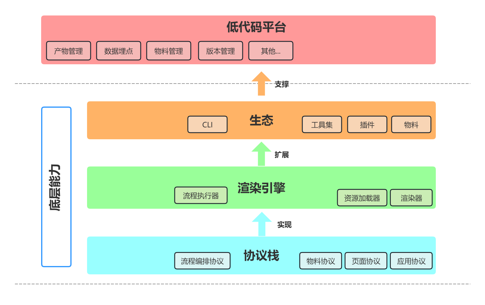

# 架构概述

## 系统设计概述



平台以 Schema 协议为基础（包括物料、页面、应用）协议，在协议的基础之上、基于 React 实现了渲染引擎，旨在通过标准协议还原 UI 视图、交互；

从开发者的角度，平台提供了快捷的的物料、插件的生产方式，以满足对于物料的自定义要求。

## 协议栈概述

### 物料协议

物料的协议包含俩部分：物料设置器协议、物料的基本信息协议：

1. 物料的设置器协议主要用于描述物料的哪些属性、交互、事件是允许物料的消费者配置的，以及该如何配置这些配置项，这部分的定义可以 [移步、查看更多](/guide/use/Schema定义)
2. 物料的基本信息协议主要用于描述物料的基本信息。

这部分的协议主要由物料的生产者提供，以下是一个简单的物料协议示例：

**物料的设置器协议示例：**

```json
[
  {
    "componentName": "DateTimeSetter",
    "props": {
      "formItemProps": {
        "label": "日期时间选择",
        "name": "dateTime"
      },
      "setter": "DateTimeSetter"
    }
  }
]
```

**物料的数据协议示例：**

```json
{
  "componentName": "ExampleButton",
  "id": "node_oclfjpfqjy5",
  "props": {
    "contentProps": {
      "style": {
        "background": "rgba(255,255,255,0)"
      }
    },
    "name": "示例组件",
    "ref": ""
  },
  "children": []
}
```

### 页面协议

页面的协议主要用于描述页面的结构、样式、生命周期、状态、方法等，以下是一个简单的页面协议示例：

```json
{
  "componentName": "Page",
  "id": "node_dockcviv8fo1",
  "props": {
    "style": {
      "height": "100%"
    }
  },
  "state": {
    "text": {
      "type": "JSExpression",
      "value": "\"示例文案\""
    }
  },
  "css": "",
  "lifeCycles": {
    "componentDidMount": {
      "type": "JSFunction",
      "value": "function componentDidMount() {\n  console.log('did mount');\n}",
      "source": "function componentDidMount() {\n  console.log('did mount');\n}"
    }
  },
  "methods": {
    "onClick": {
      "type": "JSFunction",
      "value": "function onClick() {\n  this.setState({\n    isShowDialog: true\n  });\n}",
      "source": "function onClick() {\n  this.setState({\n    isShowDialog: true\n  });\n}"
    }
  },
  "originCode": "class LowcodeComponent extends Component {\n  state = {\n    \"text\": \"outer\"\n  }\n  componentDidMount() {\n    console.log('did mount');\n  }\n  onClick() {\n    this.setState({\n      isShowDialog: true\n    });\n  }\n}",
  "title": "",
  "children": [
    {
      "componentName": "FDPage",
      "id": "node_oclfjpfqjy5",
      "props": {
        "contentProps": {
          "style": {}
        }
      },
      "title": "页面",
      "children": []
    }
  ]
}

```

## 引擎流程概述


## 周边生态概述

平台生态主要分为 3 部分，物料、设置器和插件。

### 物料生态

物料是低代码平台的生产资料，包括：

1. 低代码物料生产能力和规范（协议、自定义物料能力）；
2. 物料的规范化的开发流程（创建、开发、发布、注册、升级、下线）等；
3. AntdDesign 组件的支持（进行中）。

### 设置器生态

设置器主要负责物料配置项的统筹管理，物料的生产者在开发物料时，如果平台提供的默认的设置器无法满足时，就需要自定义开发物料的设置器，目前平台提供的默认设置器，字符、数字、布尔、数组、对象数组等。

每个设置器本质上是一个 React 组件，接受由引擎传入的参数 value 和 onChange，value 是初始传入的值，onChange 是在设置器的值变化时的回传函数，将值刨除去（类似于Form Item 中的自定义组件）。

### 插件生态

目前平台提供的插件有：源码编辑面板、大纲树面板、设置器容器面板、顶部通栏面板、Schema 预览面板等，后续会陆续开发其自定义的能力。