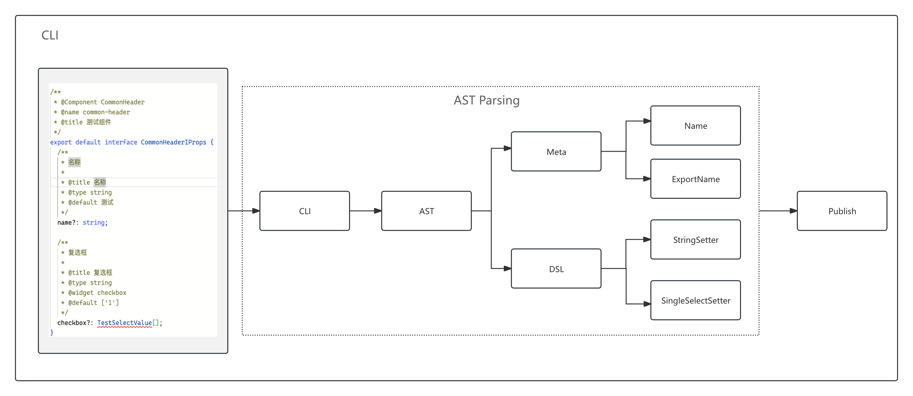
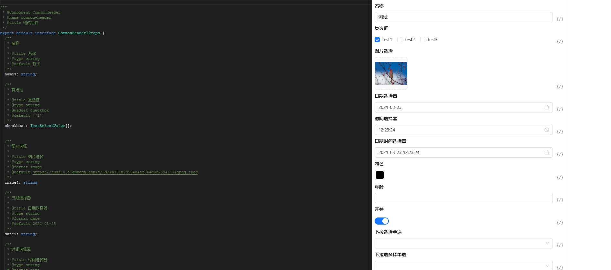

# 物料DSL解析

## 概述

当前业内大多数低代码平台的物料配置项通常通过 JSON Schema 来描述。这种方式虽然灵活，但在实际开发中存在一些明显的痛点：

1. 学习成本高：特别是对于拥有复杂配置项的物料，理解和手写 Schema 需要较高的专业知识，给开发者带来了额外的负担。
2. 重复工作量大：对于使用 TypeScript 的开发者来说，手写 JSON Schema 的过程尤为繁琐。开发者通常需要为同一个属性定义两套配置：一套是用于代码类型校验的 Interface.ts 文件，另一套是描述 Schema 的 JSON 文件，这大幅增加了开发成本。

通过自动化生成配置项，可以有效降低开发难度，提高开发效率，同时减少维护成本。

## 基本流程



[移步体验](/schema){:target="_blank"}


## 设计原理

开发者可以使用 TypeScript 编写物料的 props 类型文件 (Interface.ts)，然后通过工具将其解析成 AST，再根据 AST 中的字段和注释自动生成标准的 DSL；

例如以下代码:

```typescript

/**
 * @Component CommonHeader
 * @name common-header
 * @title 测试组件
 */
export default interface CommonHeaderIProps {
  /**
   * 名称
   *
   * @title 名称
   * @type string
   * @default 测试
   */
  name?: string;
  
  /**
   * 复选框
   *
   * @title 复选框
   * @type string
   * @widget checkbox
   * @default ['1']
   */
  checkbox?: TestSelectValue[];
}

enum TestSelectValue {
  test1 = '1',
  test2 = '2',
  test3 = '3',
}

```
通过解析后生成如下的 DSL:

:::details

```json
{
  "name": "example-test-com",
  "libName": "ExampleTestCom",
  "version": "1.0.0",
  "author": "Marvin",
  "description": "",
  "keywords": [],
  "schema": [
    {
      "componentName": "StringSetter",
      "props": {
        "formItemProps": {
          "label": "名称",
          "name": "name"
        },
        "setter": "StringSetter"
      }
    },
    {
      "componentName": "CheckboxSetter",
      "props": {
        "formItemProps": {
          "label": "复选框",
          "name": "checkbox"
        },
        "options": [
          {
            "label": "test1",
            "value": "1"
          },
          {
            "label": "test2",
            "value": "2"
          },
          {
            "label": "test3",
            "value": "3"
          }
        ],
        "setter": "CheckboxSetter"
      }
    }
  ],
  "defaultValue": {
    "name": "测试",
    "checkbox": [
      "1"
    ]
  }
}
```
:::

最后通过 DSL json 渲染的效果类似：



### AST 解析

#### 常见的方案

业内解析代码生成Ast 的工具非常多。

##### Babel

广泛用于 ES6+ 转换为 ES5，代码转译、优化和静态分析， 适合处理 JavaScript/TypeScript 代码的语法转换与优化。

1. @babel/parser：解析代码生成 AST；
2. @babel/traverse：对 AST 进行遍历，修改节点；
3. @babel/types：用于生成或修改 AST 节点；
4. @babel/generator：将 AST 转回代码；

##### Acorn

轻量级、高性能的 JavaScript 解析器， 需要自定义的语法扩展或极高的性能需求。

##### SWC

基于 Rust 的高性能 JavaScript/TypeScript 转译器，支持解析和生成 AST， 性能远超 Babel，适合需要高性能的大规模代码解析与转换。

##### TypeScript Compiler API

能解析 TypeScript 代码为 AST， 适合对 TypeScript 代码的深度解析和类型分析。

#### 最佳选择

此转换工具只用通过分析 AST 查找字段类型，不用修改源码，比较适合通过 TypeScript Compiler 实现。 TypeScript Compiler API 官方提供的文档只有一个 wiki，[TypeScript Compiler API](https://github.com/microsoft/TypeScript/wiki/Using-the-Compiler-API)， 感兴趣的可以研究研究。

1. createSourceFile

```typescript
const fileName = 'example.ts';
const content = readFileSync('./interface.ts', 'utf-8');
const sourceFile = ts.createSourceFile(fileName, content, ts.ScriptTarget.Latest, true);
```
2. forEachChild

```typescript
ts.forEachChild(sourceFile, (node: { kind: any; }) => {
  // 分析每一个node
});
```
3. SyntaxKind.InterfaceDeclaration

对于 interface 关键字段做分析处理。

4. SyntaxKind.EnumDeclaration

对于 enum 关键字段做分析处理。

4. SyntaxKind.TypeAliasDeclaration、SyntaxKind.FunctionType

对于函数类型做分析处理。

### 元数据解析

元数据解析主要负责解析物料的基本信息，包括物料名称、物料描述、物料版本、物料的每一个配置项等。

1. 通过 ts 提供的 getJSDocTags Api 获取字段对应的注释；
2. 然后逐一解析每一行注释，提取出字段的名称、已经对应的值；

#### 核心实现


``` typescript
// 逐一解析每一行注释
function parseJSDocCommentV2(docTags: readonly JSDocTag[]): Record<string, any> {
  const result: Record<string, any> = {};
  docTags.forEach(item => {
    if (item.tagName.escapedText) {
      result[item.tagName.escapedText] = item.comment
    }else {
      console.log(item)
    }
  })
  return result;
}

const jsdoc = ts.getJSDocTags(node);
const schema: Record<string, any> = {
  type: 'object',
  properties: {},
  required: [],
};
const property = parseJSDocCommentV2(jsdoc);
for(const key in property) {
   // 标记解析的入口
   if (key === 'Component') {
      schema[key] = true
   } else {
      schema[key] = property[key]
   }
}

```


