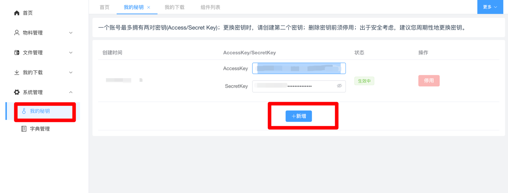

# 密钥管理

## 申请密钥

进入[秘钥管理](https://static-cdn.ry-ltd.site/lowcode-center-web/#/sysManage/myAccessList) 点击新增。

   

## 注意

:::tip

一个账号最多拥有两对密钥(Access/Secret Key)；更换密钥时，请创建第二个密钥；删除密钥前须停用；出于安全考虑，建议您周期性地更换密钥也不可泄露他人或者公开。

:::