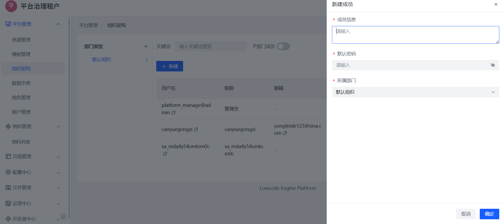

# 组织结构管理

组织结构用于构建租户内部的人员/部门体系，是用户分组、权限控制的重要基础设施。

## 一、组织结构介绍

每个租户空间都拥有独立的组织结构树，支持多级组织（如公司 → 部门 → 小组）形式。

平台默认提供一个“默认组织”，管理员可按需新增子级组织，实现树形管理。

📌 示例结构：
```
演示租户
├── 默认组织
├── 研发部
│ └── 前端组
└── 市场部
```

---

## 二、进入组织管理界面

导航位置：

> 平台管理 → 组织架构

界面结构包括：

- 组织树结构
- 成员列表
- 成员搜索与添加

📷 示例页面：


## 三、创建组织节点

1. 点击「新建」按钮；
2. 输入组织编码、名称、描述；
3. 可选设置上级组织，实现嵌套关系；

📷 创建弹窗：


## 四、组织成员管理

### 添加成员

1. 点击对应组织右上角「新增成员」；
2. 填写用户账号信息（用户名、初始密码、所属组织）；
3. 点击「确定」完成成员创建；

📷 添加成员界面：




## 五、子组织成员查看

支持勾选「子部门成员」切换视图，查看当前组织及下属组织下的所有成员。


## 六、组织结构使用建议

- 推荐使用扁平 + 2 级结构，便于管理；
- 使用组织作为“数据隔离”和“角色分配”的分组基础；
- 可将用户与多个角色关联，但只能属于一个组织节点；

> 📚 推荐阅读：
> - [用户管理指南](./user.md)
> - [租户与登录](./tenant.md)
> - [角色与权限配置](./role.md)


