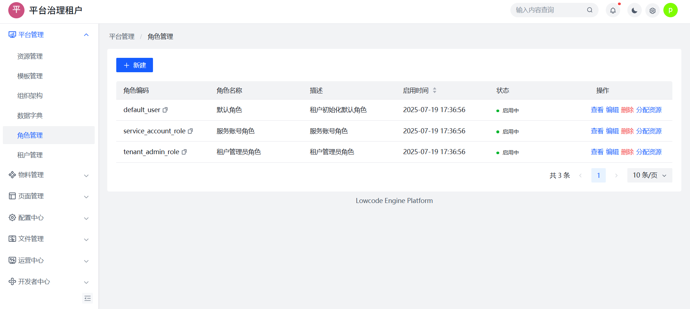
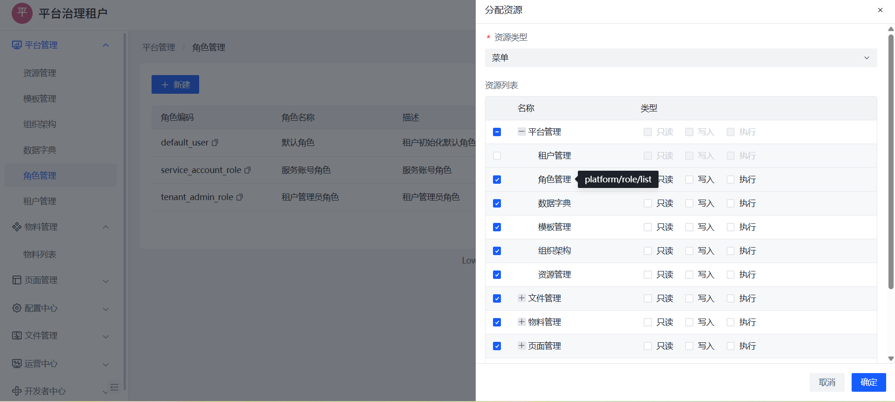
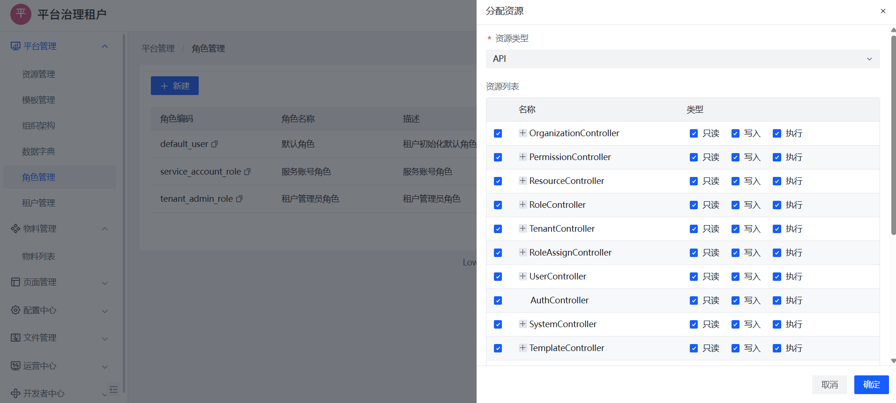

# 角色与权限配置

本节介绍平台中角色的定义、类型与权限分配方式，包括菜单与 API 权限两类。

## 一、角色体系简介

角色用于统一管理用户权限，通过“角色绑定资源 → 用户绑定角色”的方式完成授权。

- 每个租户独立维护自己的角色；
- 一个用户可拥有多个角色；
- 角色控制访问范围、操作权限；

## 二、内置角色说明

系统默认初始化以下角色：

| 角色编码             | 名称         | 说明               |
|----------------------|--------------|--------------------|
| tenant_admin_role     | 管理员角色   | 拥有全平台访问权限 |
| default_user          | 默认用户角色 | 初始绑定基础权限   |
| service_account_role  | 服务账号角色 | 接口调用型角色     |

📷 角色列表示意：

## 三、创建与管理角色

路径：平台管理 → 角色管理 → 新建角色

- 输入角色编码、名称、描述；
- 创建完成后即可分配权限；

## 四、权限分配方式

### 1️⃣ 菜单权限

控制用户是否可访问某个页面或模块（如“页面管理”、“物料管理”）。

支持操作类型：
- 只读；
- 写入；
- 执行（如触发接口）；

📷 分配菜单权限示意：

### 2️⃣ API 权限

用于控制后端 API 访问权限（如用户新增、权限分配、物料查询等）。

📷 API 授权界面：

## 五、用户绑定角色

可在【组织架构 → 用户 → 分配角色】中设置角色绑定，支持多角色绑定。

> 📌 权限为所有角色权限的合并结果。

## 六、权限控制建议

- 创建功能角色（如：内容编辑、管理员）而非按人设角色；
- 避免单用户直接配置资源权限，应通过角色赋权；
- 默认角色建议配置只读能力，重要功能通过显式授权开放；

> 📚 推荐阅读：
> - [用户管理与登录](./user.md)
> - [组织结构管理](./org.md)
> - [租户创建与初始化](./tenant.md)
