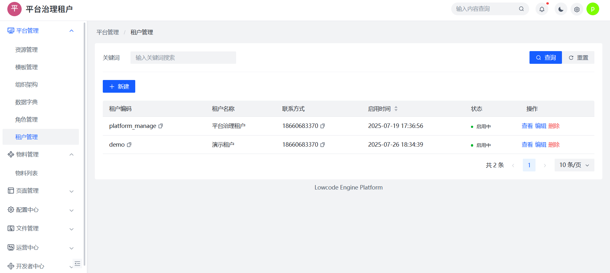

# 租户管理与登录

低代码平台支持多租户能力，平台运营方可通过创建不同租户来服务多个业务域或子公司，实现资源隔离与权限独立。


## 一、平台租户模型说明

低代码引擎采用租户 → 组织 → 用户的典型三层结构：

```
平台（统一入口）
├── 租户A
│ ├── 组织结构A-1
│ └── 用户群A
└── 租户B
├── 组织结构B-1
└── 用户群B
```

- **租户**：独立业务空间，资源隔离；
- **组织**：租户内部的部门结构；
- **用户**：挂载组织的账号，绑定角色登录平台；


## 二、租户创建方式

平台支持两种部署方式：

- 🏢 公有部署：不支持自助创建，需平台管理员审核创建；
- 🏠 私有部署：支持通过「租户管理」后台创建租户信息；

📷 创建租户：


创建后平台将自动初始化：
- 默认管理员账号（`[租户编码]@admin`）；
- 系统内置角色；
- 默认组织节点；

📷 租户管理页面：




## 三、租户下的管理能力（建议阅读）

- 📂 [组织结构管理](./org.md)：构建部门、管理组织成员；
- 👤 [用户管理与登录](./user.md)：添加用户、绑定组织、平台登录方式；
- 🔐 [角色与权限配置](./role.md)：分配菜单权限 / API 权限；


## 四、登录说明

平台登录采用「租户 + 用户账号 + 密码」三元认证机制：

📷 登录页面：


> ⚠️ 无用户自注册能力，所有账号需通过租户管理员添加。


## 五、常见问题

### Q：一个用户可以属于多个租户吗？
A：不支持，账号在租户内唯一。

### Q：租户是否可以删除？
A：支持，但需先清除其下属数据。

### Q：如何重置密码？
A：联系管理员在后台重置，平台不提供找回入口。


## 📚 推荐阅读

- [组织结构管理](./org.md)
- [用户管理指南](./user.md)
- [角色与权限配置](./role.md)

