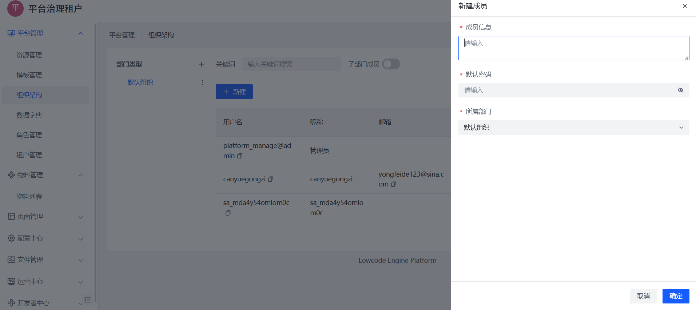
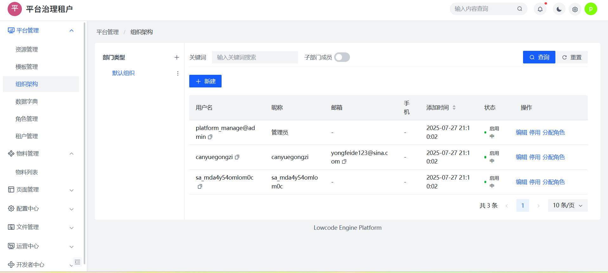

# 用户管理与登录

本章节介绍如何在租户内创建用户成员，以及用户登录平台的完整流程。

## 一、用户基本模型

- 每个用户属于一个租户；
- 每个用户必须挂载在一个组织节点下；
- 用户账号具有唯一性；
- 用户登录需输入【租户 + 账号 + 密码】；

## 二、用户创建流程

路径：平台管理 → 组织架构 → 新建成员

1. 填写成员账号、默认密码、所属组织；
2. 成员创建成功后，可登录使用；
3. 初始状态为“启用”；

📷 新建用户弹窗：

> ⚠️ 注意：平台不支持用户自注册，必须由管理员添加。

## 三、用户信息维护

在用户列表中点击「编辑」可维护用户昵称、邮箱、状态等信息。

支持操作：
- 启用 / 停用 用户；
- 分配角色（见角色权限文档）；

📷 成员管理列表：

## 四、用户登录说明

平台采用租户 + 账号的登录方式：

1. 登录页选择所属租户；
2. 输入用户账号与密码；
3. 点击登录按钮，进入平台主页；

📷 登录界面：

> ✅ 成功登录后权限由绑定的角色控制，未授权页面将不可访问。

## 五、常见问题

### Q：一个用户能加入多个组织吗？
A：不支持，每个用户仅绑定一个组织。

### Q：用户忘记密码怎么办？
A：由租户管理员重置。

> 📚 推荐阅读：
> - [组织结构管理](./org.md)
> - [角色与权限配置](./role.md)
> - [租户与登录说明](./tenant.md)
