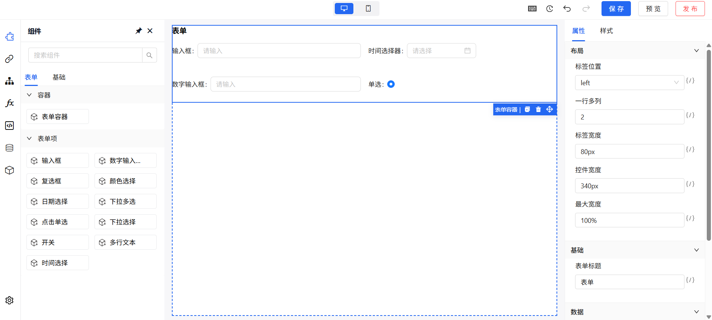

# 页面搭建能力概览

低代码平台提供所见即所得的可视化页面搭建能力，业务人员或开发者无需编写前端代码，即可通过拖拽组件、配置属性、绑定数据等方式快速构建业务页面。

本节将介绍页面搭建的基本概念、核心结构与操作入口。

## 一、页面搭建核心理念

页面构建采用 Schema 驱动 + 组件化设计 的组合模式：

- **Schema（页面结构描述）**：每个页面对应一份 JSON 描述文件，记录组件树结构、属性配置、绑定数据等信息；
- **物料组件（Material）**：平台预设常用基础组件（如表单、表格、按钮等），也支持扩展业务组件；
- **画布（Canvas）**：拖拽组件并实时预览搭建效果的区域，支持自由布局与嵌套容器；
- **右侧配置面板**：用于配置选中组件的属性、事件、数据源等；

📷 页面搭建器示意图：




## 二、页面构成结构

一个页面由多个部分组成，逻辑结构如下：
```
PageSchema
├── meta：页面级属性（标题、路径等）
├── componentsMap：组件描述结构（按组件 ID 存储）
├── packagesMap：使用的物料依赖（记录组件来源与版本）
└── dataSources：页面绑定的数据源集合
└── componentsTree：页面绑定的数据源集合
```

> 📌 页面搭建的每一次拖拽、配置修改，底层都是对 Schema 的增删改。


## 三、搭建流程简介

1. **选择页面**：进入某一页面的设计视图；
2. **拖入组件**：从左侧组件区选择一个组件，拖拽至画布；
3. **配置属性**：点击组件，右侧配置面板显示可调属性；
4. **绑定数据**：若组件支持数据源（如表格、列表），可在数据面板绑定远程或本地数据；
5. **设置交互**：在事件面板中配置组件行为（如点击跳转、调用接口等）；
6. **预览与发布**：点击右上角预览查看效果，确认后可进行页面发布；


## 四、常见页面类型

平台支持以下常见页面类型：

| 页面类型   | 说明                                       |
|------------|--------------------------------------------|
| 表单页     | 用于创建/编辑业务数据，常包含输入项和提交按钮 |
| 列表页     | 展示业务数据列表，支持分页、搜索、操作按钮等 |
| 报表页     | 图表组件组合而成的可视化数据展示页面         |
| 嵌套页面   | 页面中可嵌套其他页面模块或动态区域             |

页面类型不是固定模板，而是通过组件组合灵活实现。


## 五、搭建器功能入口说明

| 区域         | 功能描述                            |
|--------------|-------------------------------------|
| 页面导航区   | 显示当前编辑页面，支持跳转与切换        |
| 组件区       | 展示所有可用物料组件，按分类展示        |
| 画布         | 拖拽组件的可视区域，实时渲染编辑效果    |
| 属性配置面板 | 展示当前选中组件的配置项、事件、数据等 |
| 快捷操作栏   | 预览、发布、撤销/重做、Schema 导出等操作 |


## 六、进阶推荐

搭建页面仅是起点，平台还支持以下能力：

- 🌐 数据源绑定：页面可绑定 AJAX 请求、模拟数据、动态映射等；
- 🔗 页面跳转与联动：组件间通过事件实现页面间跳转、参数传递；
- 🎯 权限控制：页面组件可配置角色权限控制显隐；
- 🧱 自定义组件：支持导入业务组件，扩展平台能力；

> 📚 推荐继续阅读：
> - [页面管理与新建流程](./page.md)


