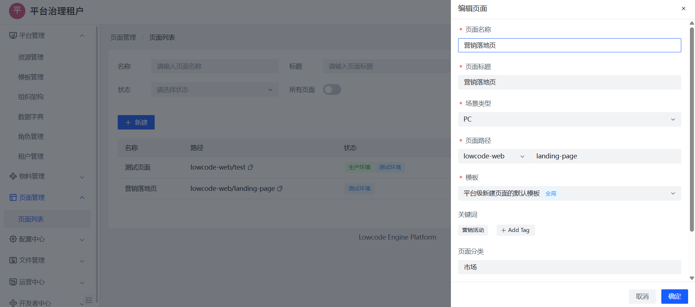

# 页面管理与新建流程

页面是低代码平台的核心构建单元，所有搭建工作均围绕页面展开。平台支持多页面管理、版本控制与一键发布能力，满足从开发到上线的完整流程。

## 一、页面管理概览

页面管理模块提供以下功能：

- 页面分组与列表查看；
- 新建页面（支持复制已有页面）；
- 页面信息编辑（名称、路径等）；
- 页面版本查看与回滚；
- 页面预览与发布；

📷 页面管理界面示意：

## 二、新建页面流程

路径：平台管理 → 页面管理 → 新建页面

1. 点击右上角「新建页面」；
2. 填写页面基础信息：
    - 页面名称（展示用）；
    - 页面编码（系统唯一标识）；
    - 页面路径（最终访问地址）；
    - 所属分组 / 分类；
3. 确认创建后进入可视化搭建界面。

📷 新建页面弹窗：

## 三、页面信息编辑

在页面列表中可点击某一页面的「编辑」按钮，进入详情配置：

- 支持修改名称、路径、说明、favicon；
- 支持设置页面品牌、地区、SEO meta 等扩展字段；
- 所有信息修改均立即生效（不影响搭建内容）；

📷 页面信息编辑：

## 四、页面版本控制

平台对每次页面保存操作都会生成一个版本记录，便于回溯与对比。

### ✅ 版本能力包括：

- 历史版本列表查看（含提交人、时间）；
- 版本内容预览（JSON Diff）；
- 一键回滚至历史任意版本；
- 支持版本备注填写（如“上线初版”）；

📷 页面版本管理：

## 五、页面预览与调试

在页面搭建器中点击右上角「预览」按钮：

- 自动生成临时预览地址；
- 支持带参数预览；
- 使用真实数据源、真实组件运行；
- 可联调事件逻辑与接口请求；

> 🔎 注意：预览不代表正式上线，仅供测试使用。

📷 页面预览效果：

## 六、页面发布机制

页面搭建完成并测试通过后，点击「发布」按钮可将当前页面内容正式上线。

### ✅ 发布流程包含：

1. 自动保存并生成新版本；
2. 合成页面依赖组件与资源（版本锁定）；
3. 写入最新版本记录；
4. 上传 HTML 至 OSS/CDN（私有部署场景）；
5. 更新线上访问地址（含路径与版本）；

> 📌 每次发布都带有版本号标识，历史页面不会被覆盖。

📷 页面发布操作：

## 七、页面分类与搜索

支持按页面类型、创建人、更新时间进行筛选与搜索，便于管理大量页面资源。

## 八、页面删除与恢复

- 支持逻辑删除（软删），避免误删；
- 删除后页面不可编辑与访问；
- 平台管理员可进入「回收站」进行恢复或永久清除；

## 九、页面命名建议

| 类型     | 命名建议                   |
|----------|----------------------------|
| 页面编码 | 英文+横杠组合，如：`user-list` |
| 页面名称 | 中文名，如：用户列表             |
| 路由路径 | `/admin/user/list` 等语义清晰路径 |

> ⚠️ 页面编码需唯一，避免与已有页面/组件冲突。

## 十、推荐继续阅读

- [页面搭建能力概览](./overview.md)
- [自定义物料](../use/material.md)
