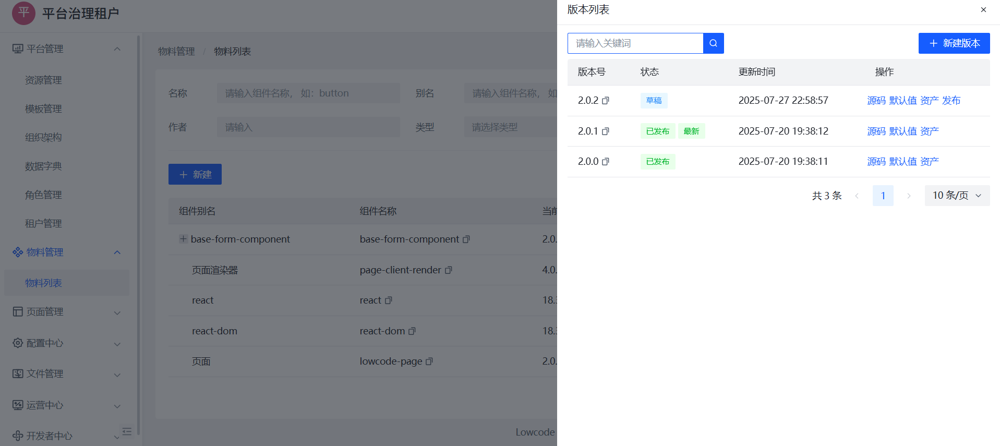
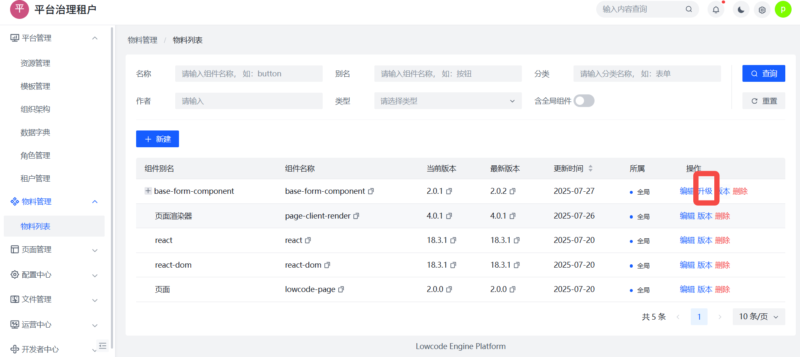
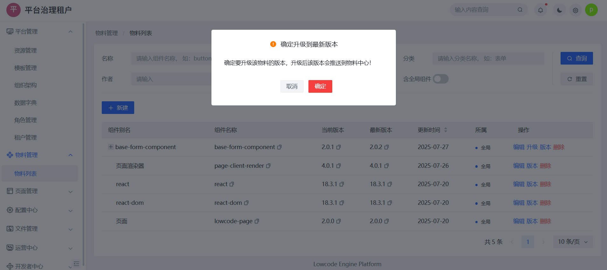

# 自定义物料

平台支持开发者使用 `@wu-component/wu-cli` 脚手架创建、开发和发布自己的物料组件。物料支持低代码平台接入，包括属性 Schema 自动生成、版本管理、资源配置等能力。

## 创建第一个物料

1. 安装脚手架
   @wu-component/wu-cli 是于搭建平台配套使用的教授架，用于物料的创建、开发、发布（该脚手架不仅可以开发物料，也可以开发 WebComponent 以及传统的 Web 项目）。
   ```
   npm i @wu-component/wu-cli -g
   ```

2. 创建项目
   ```
   wu create <application-app-name> -c material
   # 例如： wu create lowcode-test-component -c material
   ```
   application-app-name 为要创建的物料名称。
   
   生成的目录结构如下：

   ```
   ├── demo                   
   |  └── basic.md
   ├── example
   |  ├── example.css
   |  └── example.tsx
   ├── index.html
   ├── IProps.d.ts             // 组件的类型定义，最终会转换成组件配置项的 schema 
   ├── package-lock.json
   ├── package.json
   ├── README.md
   ├── src                     // 组件开发工作区
   |  ├── index.scss           
   |  └── index.tsx            // 组件入口
   ├── tsconfig.json
   ├── tsconfig.node.json
   └── wu.config.ts            // 物料开发、构建、发布的配置项
   ``` 

3. 开发服务器
   启动开发服务器就可以愉快的开发了， 命令如下（dev 脚本会执行 wu dev，底层依赖 vite 的 dev-server）：
   ```
   npm run dev
   ```

## 物料发布

### 物料构建

执行构建命令 build， 命令如下（build 脚本会执行 wu build，底层依赖 vite 的构建）：

```
   npm run build
```

构建的产物如下(和wu-config.ts 中的 format 关联)：


```
 ├── es               // es 格式的产物
 ├── umd              // es 格式的产物
 ├── index.d.ts       // 类型文件
 └── schema.json      // 物料的 schema 协议
```

### 物料发布

执行发布命令前，需要校验以下内容：

1. 确保 package.json 中的 version 和已有版本不会冲突；
2. 确保 wu.config.ts 中 user.clientId 必须是正式存在的开发者应用。

一切准备就绪后执行 发布命令：

```
wu upload
```

:::tip

首次执行 ``` wu upload ``` 时会执行登录授权的逻辑，控制台会提示自动打开浏览器进行登录授权（如无法自动打开浏览器，则可以手动复制 url 打开）。

:::


### 升级线上版本

组件提示发布成功后，进入，可以通过 版本日志查看组件详情，也可以酌情升级/发布组件。
```
    ✔ 物料上传成功
    ✔ 🎉 🎉 🎉 🎉 物料common-text@1.0.0发布成功，请前往物料中心升级！！！
```





## 文件说明

### wu.config.ts

#### 配置示例

wu.config.ts 基本配置如下：

```ts

import { defineConfig } from '@wu-component/wu-cli';

export default defineConfig({
  meta: {
    type: 'material',
    lib: {
      libName: "LowcodeTestComponent",
      name: "lowcode-test-component",
      formats: ['umd', 'es'],
      fileName: (_format) => `{{name}}.production.js`,
      external: {
        react: 'React',
        'react-dom': 'ReactDOM',
      }
    },
    user: {
      // 平台域名，私有化部署时填写私有化部署的域名
      // host: 'https://static-cdn.ry-ltd.site',
      clientId: "ak_7xsx39",
      host: 'https://static-cdn.ry-ltd.site'
    }
  }
})
```

#### 配置项

| 名称   | 类型   | 必填 | 默认值 | 说明       |
|:-----|:-----|:---|:----|----------|
| meta | Meta | 是  | --  | 物料的元数据配置 |

##### Meta

| 名称   | 类型               | 必填 | 默认值      | 说明                                            |
|:-----|:-----------------|:---|:---------|-----------------------------------------------|
| type | ProjectType      | 是  | material | 项目的类型，此时默认为 material，此值还可以是 web、web-component |
| lib  | ProjectLibConfig | 是  | --       | 物料构建、开发时的配置，创建项目时自动生成，可以自己修改                  |
| user | CliUser          | 否  | --       | 发布物料时的用户信息配置，1：需要在平台注册成为用户，2：首次发布物料需要登录授权     |


#####  ProjectLibConfig

| 名称       | 类型                | 必填 | 默认值                                      | 说明                                                |
|:---------|:------------------|:---|:-----------------------------------------|---------------------------------------------------|
| libName  | String            | 是  | 自动生成                                     | 物料 umd 构建产物的变量名称，同 vite\webpack 的 library.name 配置 |
| name     | String            | 是  | 自动生成                                     | 物料名称，平台内必须保持唯一性                                   |
| formats  | String[]          | 是  | ['umd', 'es', 'cjs', 'iife']             | 物料构建产物的类型，类似 vite\webpack 的format 配置              |
| fileName | (format) =>String | 是  | format => `${format}.js`                 | 物料构建产物的fileName，类似 vite\webpack fileName 配置       |
| external | Object            | 否  | {react: 'React','react-dom': 'ReactDOM'} | 物料构建 external，类似 vite\webpack external 配置         |

#####  CliUser

| 名称       | 类型     | 必填 | 默认值 | 说明                    |
|:---------|:-------|:---|:----|-----------------------|
| host     | String | 是  | -   | 平台域名，私有化部署时填写私有化部署的域名 |
| clientId | String | 是  | -   | 注册的开发者 clientId       |


### IProps.d.ts

该文件是物料的类型定义文件,物料的 Schema 通过该文件中定义的 TypeScript 类型结合注释来生成，该文件会自动创建，开发者可根据需求自定义组件 Schema。


> 📚 推荐继续阅读：
> - [物料类型定义](/guide/use/Schema定义)
> - [TS类型转Schema设计原理](/guide/framework/type-to-ast)
